# PodcastAnalyzer - State Machine Architecture

This document provides a comprehensive overview of the state machines and workflows in the PodcastAnalyzer application.

## Table of Contents
1. [Overall System Architecture](#overall-system-architecture)
2. [Download State Machine](#download-state-machine)
3. [Transcript Generation State Machine](#transcript-generation-state-machine)
4. [AI Analysis State Machine](#ai-analysis-state-machine)
5. [Playback State Machine](#playback-state-machine)
6. [Complete Workflow Integration](#complete-workflow-integration)

---

## Overall System Architecture

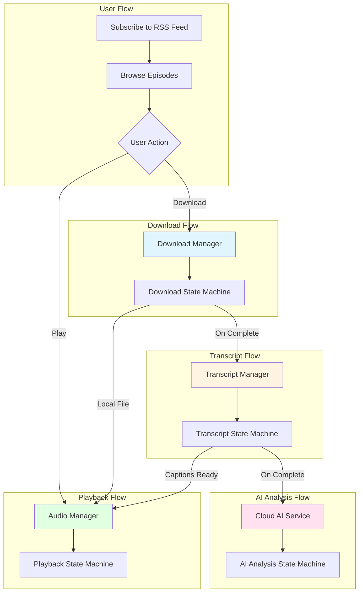

---

## Download State Machine

The `DownloadState` enum manages episode audio file downloads with progress tracking.

### States
```swift
enum DownloadState {
    case notDownloaded
    case downloading(progress: Double)  // 0.0 to 1.0
    case finishing                      // Processing downloaded file
    case downloaded(localPath: String)
    case failed(error: String)
}
```

### State Transitions
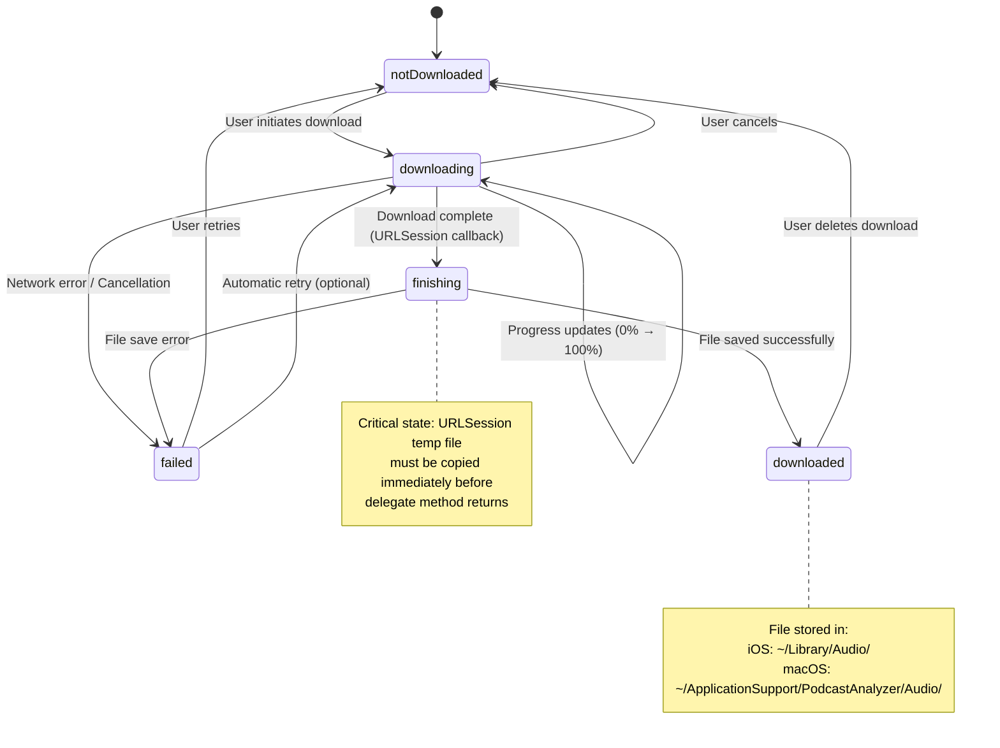

### Key Implementation Details
- **Manager**: `DownloadManager.shared` (Singleton, @Observable)
- **Concurrency**: Background URLSession with up to 4 parallel downloads
- **Storage**: `FileStorageManager` actor handles file I/O
- **Auto-Transcript**: On download completion, optionally queues transcript generation
- **State Persistence**: Checks disk on app launch to restore `downloaded` state

### Code Location
- `PodcastAnalyzer/Services/DownloadManager.swift`
- `PodcastAnalyzer/Models/DownloadState.swift` (lines 19-25)

---

## Transcript Generation State Machine

The `TranscriptJobStatus` enum manages speech-to-text transcription using Apple's Speech framework.

### States
```swift
enum TranscriptJobStatus {
    case queued
    case downloadingModel(progress: Double)  // 0.0 to 1.0
    case transcribing(progress: Double)      // 0.0 to 1.0
    case completed
    case failed(error: String)
}
```

### State Transitions
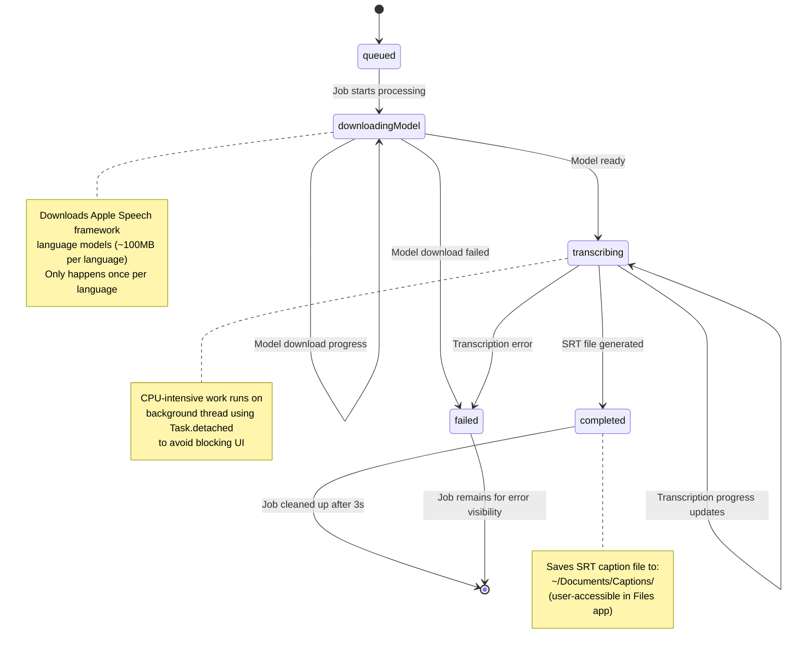

### Parallel Processing
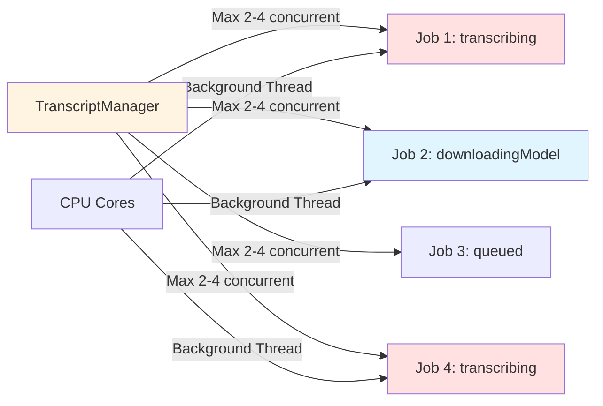

### Key Implementation Details
- **Manager**: `TranscriptManager.shared` (iOS 17+, @Observable)
- **Service**: `TranscriptService` actor for Speech framework operations
- **Concurrency**: 2-4 parallel jobs based on device CPU cores
- **Output**: SRT subtitle format with ~5 second segments
- **Language Support**: Auto-detects from podcast metadata (supports 30+ languages)
- **Auto-Queue**: Triggered automatically if "Auto-Transcript" is enabled

### Code Location
- `PodcastAnalyzer/Services/TranscriptManager.swift`
- `PodcastAnalyzer/Services/TranscriptService.swift`

---

## AI Analysis State Machine

The `AnalysisState` enum manages cloud-based AI analysis of transcripts using user-provided API keys (BYOK - Bring Your Own Key).

### States
```swift
enum AnalysisState {
    case idle
    case analyzing(progress: Double, message: String)
    case completed
    case error(String)
}
```

### State Transitions
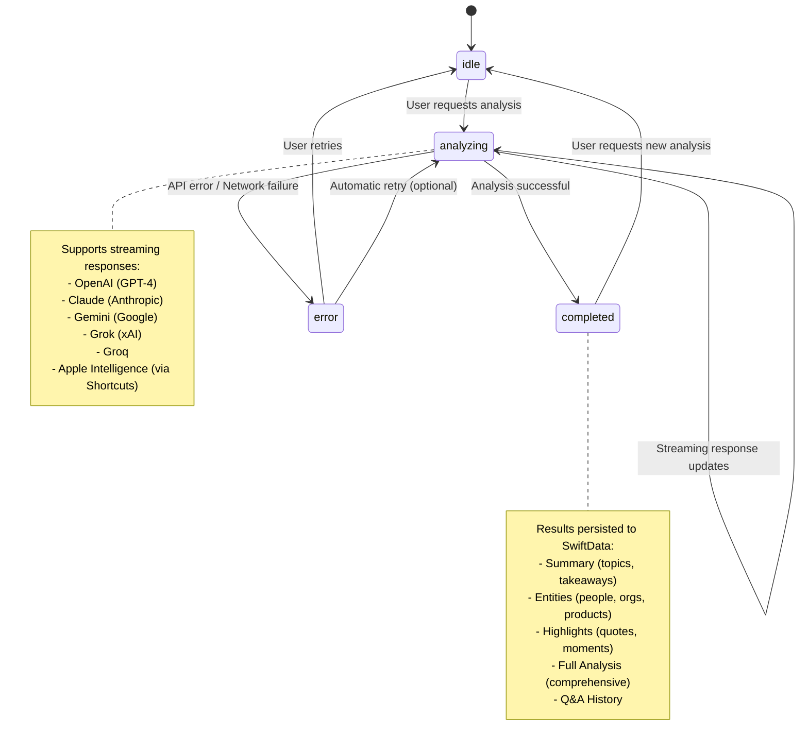

### Analysis Types & Workflow
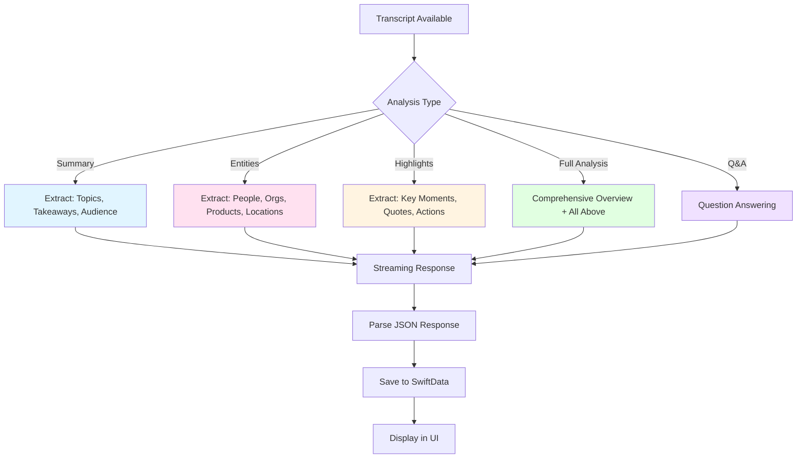

### Key Implementation Details
- **Service**: `CloudAIService.shared` (@MainActor)
- **Settings**: `AISettingsManager` manages API keys and provider selection
- **Providers**:
  - OpenAI (GPT-4o, GPT-4o-mini)
  - Claude (Haiku 4.5, Sonnet 4.5, Opus 4.5)
  - Gemini (2.5 Flash, 2.0 Pro)
  - Grok (2, 3)
  - Groq (Llama, Mixtral)
  - Apple Intelligence (via Shortcuts app)
- **Response Format**: JSON with structured fields (parsed using Codable)
- **Streaming**: Real-time token-by-token display for better UX
- **Persistence**: `EpisodeAIAnalysis` SwiftData model

### Code Location
- `PodcastAnalyzer/Services/CloudAIService.swift`
- `PodcastAnalyzer/Models/AIAnalysisModel.swift`
- `PodcastAnalyzer/Models/EpisodeAnalysisModels.swift`

---

## Playback State Machine

The playback engine manages audio playback with background support, queue management, and caption display.

### Playback States
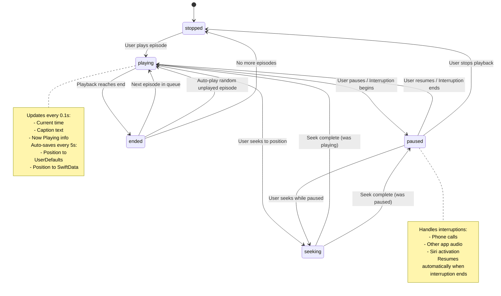

### Queue Management
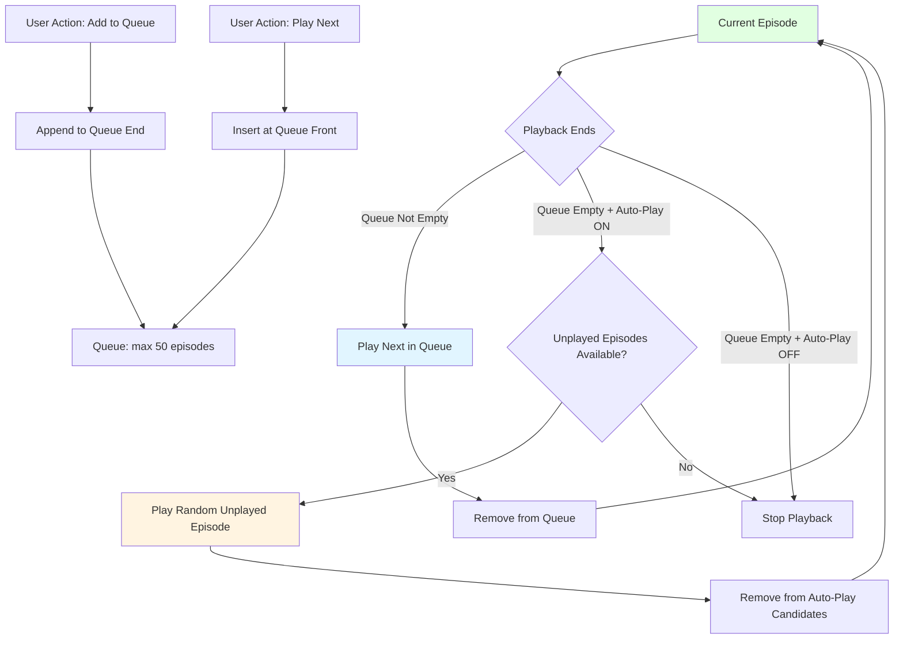

### Audio Session & Background Playback
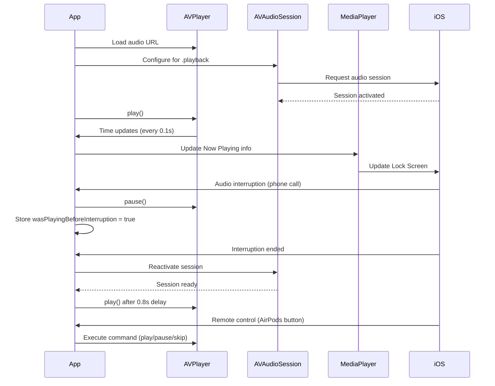

### Caption Display
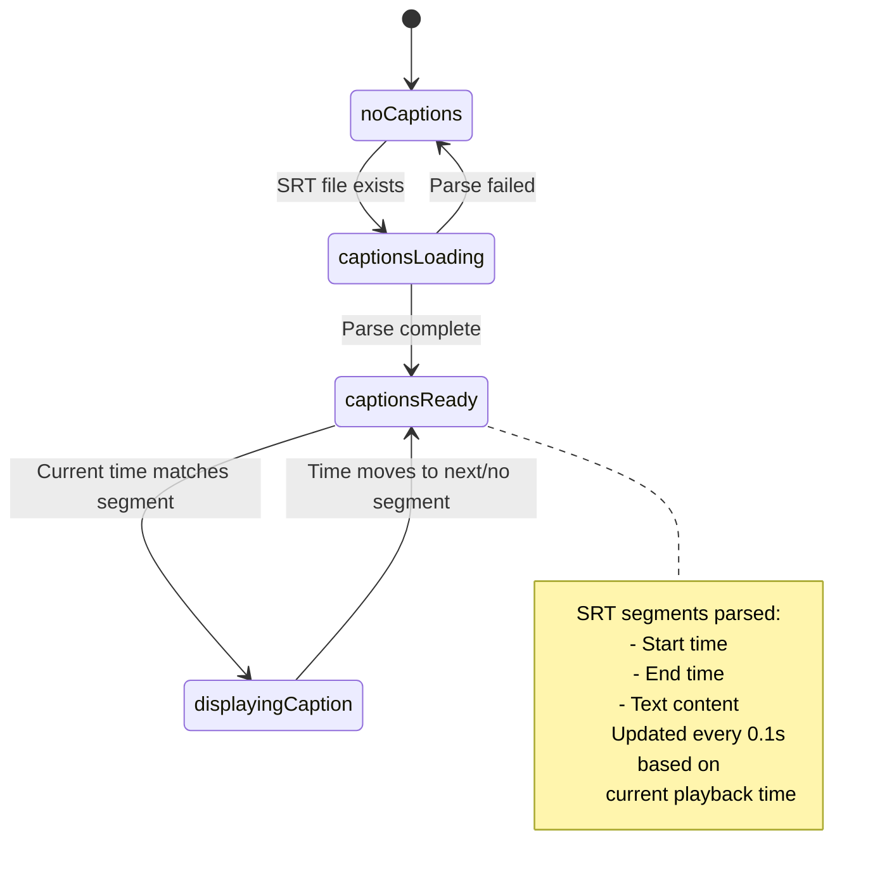

### Key Implementation Details
- **Manager**: `EnhancedAudioManager.shared` (Singleton, @Observable)
- **Player**: AVPlayer with AVAudioSession for background playback
- **Remote Controls**: MediaPlayer framework for lock screen/AirPods/CarPlay
- **Queue**:
  - Max 50 episodes
  - Supports reordering
  - "Play Next" vs "Add to Queue"
- **Auto-Play**: Random selection from unplayed episodes when queue is empty
- **Speed Control**: 0.5x to 2.0x playback rate
- **Captions**: SRT file parsing and time-synchronized display
- **State Persistence**:
  - UserDefaults: Last episode, position, speed
  - SwiftData: Per-episode playback progress

### Code Location
- `PodcastAnalyzer/Services/EnhancedAudioManager.swift`

---

## Complete Workflow Integration

### End-to-End User Journey
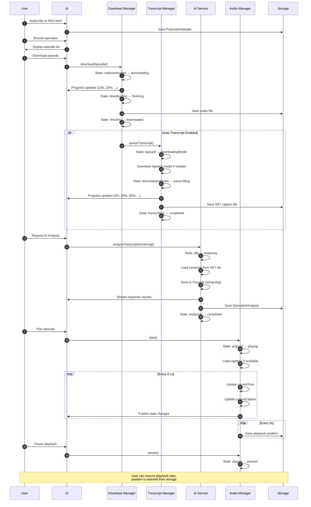

### State Dependencies & Triggers
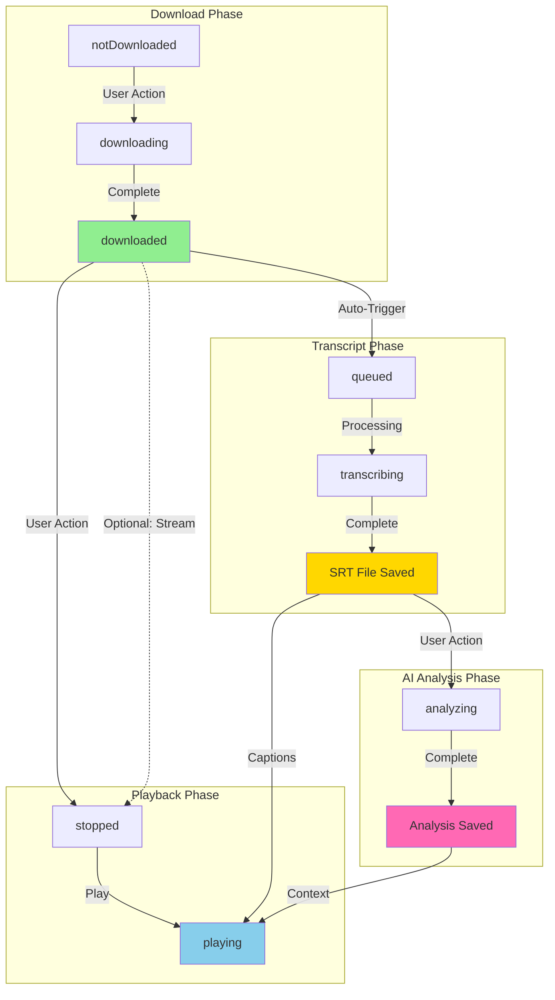

### Concurrent State Machines
Multiple episodes can be in different states simultaneously:

| Episode | Download | Transcript | AI Analysis | Playback |
|---------|----------|------------|-------------|----------|
| Episode 1 | downloaded | completed | completed | **playing** |
| Episode 2 | downloaded | transcribing (75%) | idle | stopped |
| Episode 3 | downloading (50%) | queued | idle | stopped |
| Episode 4 | notDownloaded | - | - | stopped |

**Key Points:**
- Download Manager: Max 4 concurrent downloads
- Transcript Manager: Max 2-4 concurrent transcription jobs
- Audio Manager: Only 1 episode can be playing at a time
- AI Service: Processes one analysis request at a time (per episode)

---

## Implementation Patterns

### Singleton Services
All major services use the singleton pattern for global state management:
```swift
DownloadManager.shared
TranscriptManager.shared
EnhancedAudioManager.shared
CloudAIService.shared
FileStorageManager.shared
```

### Concurrency Models
- **Actors**: `TranscriptService`, `FileStorageManager` (thread-safe async operations)
- **@Observable**: `DownloadManager`, `TranscriptManager`, `EnhancedAudioManager` (SwiftUI reactive updates)
- **@MainActor**: `CloudAIService` (UI-bound operations)

### State Persistence
- **UserDefaults**: Lightweight state (playback position, settings)
- **SwiftData**: Relational data (episodes, analysis results, download records)
- **FileManager**: Binary data (audio files, caption files)

### Error Handling Strategy
All state machines include explicit error states and recovery paths:
- **Download**: Retry on network failure, cancel on user request
- **Transcript**: Fail gracefully, show error in UI
- **AI Analysis**: Parse API errors, suggest remediation
- **Playback**: Handle interruptions, resume when possible

---

## Architecture Highlights

### ✅ Strengths
- **Clear State Separation**: Each domain has its own state machine
- **Observable Pattern**: SwiftUI-friendly reactive updates
- **Async/Await**: Modern Swift concurrency throughout
- **Background Processing**: Downloads and transcriptions continue when app is suspended
- **Graceful Degradation**: Each feature works independently (can play without transcript, transcript without AI)
- **Parallel Processing**: Efficient use of device resources

### 🔄 State Synchronization
- Download completion triggers transcript queue (if enabled)
- Transcript completion enables AI analysis
- All states update UI reactively via @Observable
- SwiftData provides persistence layer for cross-session state recovery

### 🎯 User Experience Flow
1. **Immediate Feedback**: All operations show progress (0-100%)
2. **Background Work**: CPU-intensive tasks run on background threads
3. **State Restoration**: App remembers playback position and download state
4. **Queue Management**: Smart auto-play keeps users engaged
5. **Offline-First**: Core playback works without network

---

## File References

### Core Services
- `PodcastAnalyzer/Services/DownloadManager.swift` - Download state machine
- `PodcastAnalyzer/Services/TranscriptManager.swift` - Transcript job management
- `PodcastAnalyzer/Services/TranscriptService.swift` - Speech framework integration
- `PodcastAnalyzer/Services/CloudAIService.swift` - AI analysis orchestration
- `PodcastAnalyzer/Services/EnhancedAudioManager.swift` - Playback engine
- `PodcastAnalyzer/Services/FileStorageManager.swift` - File I/O operations

### Models
- `PodcastAnalyzer/Models/DownloadState.swift` - Download state enum
- `PodcastAnalyzer/Models/AIAnalysisModel.swift` - AI analysis persistence
- `PodcastAnalyzer/Models/EpisodeAnalysisModels.swift` - Analysis types and cache

### ViewModels
- `PodcastAnalyzer/ViewModels/EpisodeDetailViewModel.swift` - Episode detail coordination
- `PodcastAnalyzer/ViewModels/PlayerViewModel.swift` - Playback UI state

---

*Generated: 2026-01-18*
*PodcastAnalyzer - iOS/macOS Podcast Player & Analyzer*
